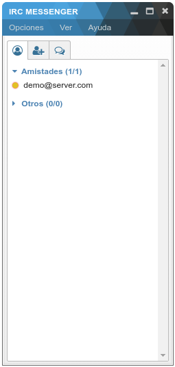

# IRC Messenger




## Instrucciones

Para instalar las dependencias se debe ejecutar:

```bash
# Modo desarrollo
npm install

# Modo productivo
npm install --production
```

Para ejecutar la aplicación se debe usar:

```bash
npm start
```


## Lista de cambios

**No estable**. Este proyecto aun no es funcional.
